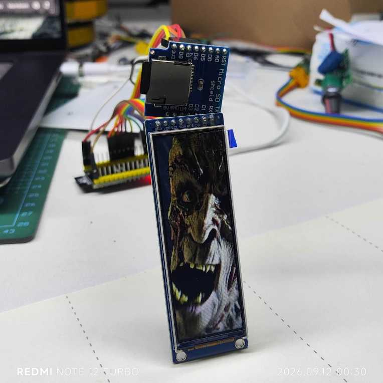

# NV3007LCD播放sd卡中mjpg文件

本项目展示在esp32s3芯片上实现挂载sd卡，读取mjpg文件，并解码播放在lcd显示屏上。



## 软件环境
ESP-IDF 6.1，target: esp32s3n16r8

    gh repo clone wsd1/LCD-NV3007-142x428-mjpg-decode
    cd LCD-NV3007-142x428-mjpg-decode
    idf.py build


## 硬件信息
NV3007 SPI LCD，2.79" 条形屏，142×428，RGB565


硬件接线：SPI2

| 信号 | GPIO | 说明 |
|---|---|---|
| SCK | 7 | SPI 时钟 |
| MOSI/SDA | 8 | SPI 数据 |
| RST | 9 | 复位，低有效 |
| DC | 10 | 数据/命令选择 |
| CS | 11 | 片选，低有效 |
| BL | 12 | 背光（普通 GPIO 点亮） |


SD卡：SPI3

| 信号 | GPIO | 说明 |
|---|---|---|
| SCK | 16 | SPI 时钟 |
| MOSI | 17 | SPI 数据 |
| MISO | 18 | SPI 数据 |
| SS/CS | 15 | 片选 |


## 文档接口

可以使用ESP官方提供的文档接口获取支援，如何使用请参见：

    docs/mcp-use-esp-docs.md


## 构建工具记录

	idf.py create-project LCD-NV3007-142x428-mjpg-decode
    cd LCD-NV3007-142x428-mjpg-decode
    

本项目使用模组：esp_video_render。安装过程如下。

    idf.py add-dependency "espressif/esp_video_render^1.0.0~2"

设置芯片:

	idf.py set-target esp32s3

修改配置:

	idf.py menuconfig
	idf.py save-defconfig

注意: 不要将 sdkconfig 文件纳入git管理。


构建编译:

	idf.py reconfigure
	idf.py build


## 生成mjpeg文件的方法

将512x512的mp4文件截取中心区域142x428，指令如下。

```
$ cd /Volumes/RAM_DISK/idf-test/LCD-NV3007-142x428-mjpg-decode && ffmpeg -i "/Users/wsd1/Movies/20260908-爸妈基因好.mp4" \
   -vf "crop=170:512:171:0,scale=142:428" \
   -c:v mjpeg -q:v 5 -r 30 \
   -an \
   -t 3.75 \
   video.mjpeg 
```

生成的文件无法在常见的播放器上打开。可以使用ffplay播放。


### 裁剪参数
```bash
crop=170:512:171:0
```
- **170**：裁剪宽度（从512像素中裁剪中间部分）
- **512**：裁剪高度（保持原始高度）
- **171**：X偏移（从左边开始，居中裁剪）
- **0**：Y偏移（从顶部开始）

### 缩放参数
```bash
scale=142:428
```
- 将裁剪后的170x512图像缩放到142x428

### 编码参数
```bash
-c:v mjpeg -q:v 5 -r 30
```
- **mjpeg**：MJPEG编码格式
- **-q:v 5**：质量参数（2-31，值越小质量越高）
- **-r 30**：输出帧率30fps
