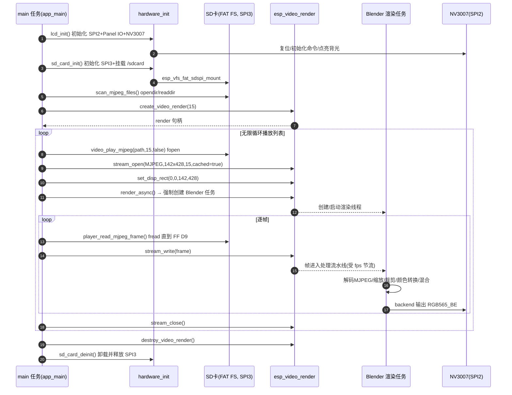
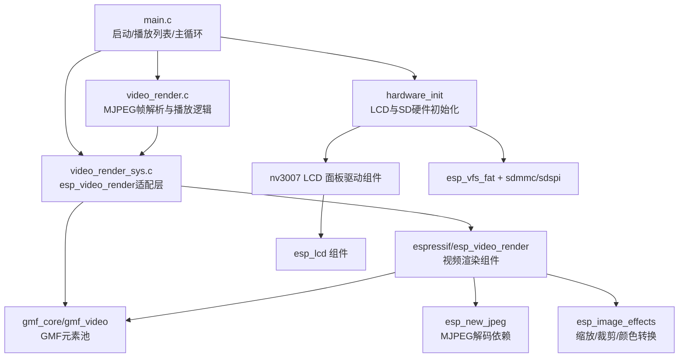
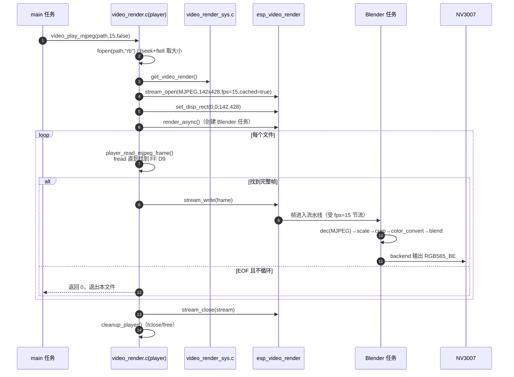
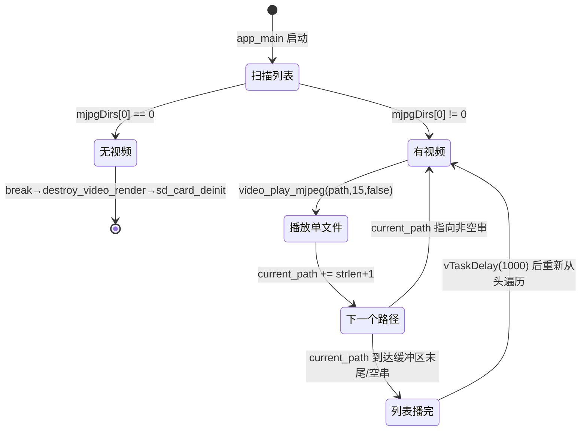
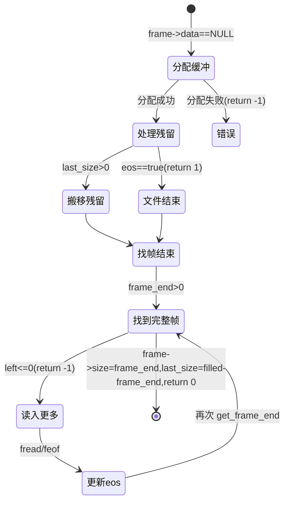
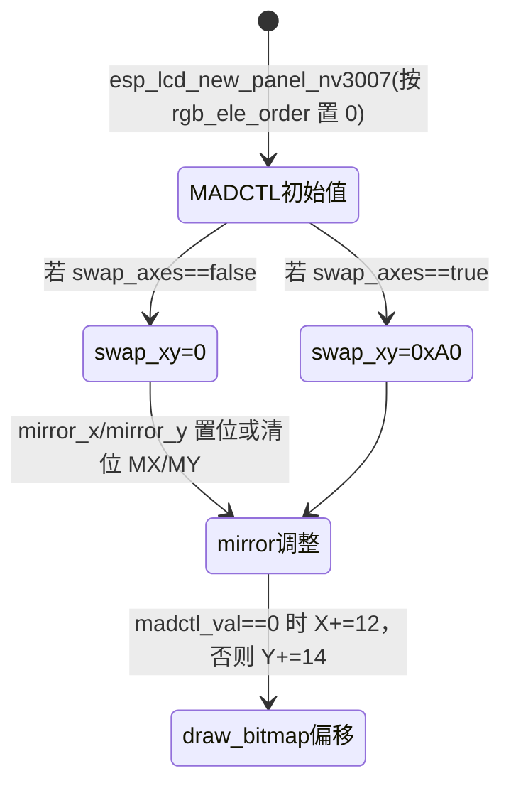

# 嵌入式系统程序分析：NV3007 LCD MJPEG 播放器

> 分析对象：`LCD-NV3007-142x428-mjpg-decode`
> 目标芯片：ESP32-S3（ESP-IDF 6.1，target `esp32s3n16r8`）
> 功能：挂载 SD 卡 → 扫描 MJPEG 文件 → 循环解码播放 → 输出到 NV3007 SPI 条形屏（142×428，RGB565）。

本文按《嵌入式系统程序分析方法》SKILL 的结构组织，所有结论尽量以源码为依据：
- **事实**：可从代码直接确认。
- **推断**：依据调用关系、命名或上下文推测，已明确标注。
- **无法确认**：明确说明。

作者：deepseek v4 pro

---

## 1. 程序是怎么运行的

### 1.1 运行模型总述

- 本程序运行在 **FreeRTOS + ESP-IDF** 之上（事实：`main.c`、`hardware_init.c`、`video_render.c` 均包含 `freertos/FreeRTOS.h`、`freertos/task.h`）。
- 程序本身 **只显式创建了一个任务**（main 任务由系统启动，`app_main` 是其入口）；真正的视频渲染由依赖组件 `esp_video_render` 在调用异步渲染接口后 **动态创建内部渲染任务**（线程名为 `Blender`）。
  - 事实：项目自身没有 `xTaskCreate*` 调用（全局检索仅 `hardware_init.c` 中被注释掉的信号量相关代码，无任务创建）。
  - 事实：`esp_video_render_stream_render_async()` 的组件实现会调用 `try_create_render_thread(..., true)`，内部通过 `esp_gmf_oal_thread_create(NULL, "Blender", ...)` 创建渲染线程（见 `managed_components/espressif__esp_video_render/src/esp_video_render.c:408-434`）。
- 因此运行时可划分为两个参与者：
  1. **main 任务**（`app_main`，播放控制 + 文件读取 + 写入帧数据，生产者角色）。
  2. **`Blender` 渲染任务**（`esp_video_render` 内部，解码/缩放/裁剪/颜色转换/混合并刷新 LCD，消费者角色）。

### 1.2 任务（task）及其作用

| 任务 | 是否本项目创建 | 主要作用 | 与谁交互 |
| :--- | :--- | :--- | :--- |
| `main`（`app_main`） | 否，FreeRTOS 启动入口 | 初始化 LCD/SD → 扫描文件 → 循环播放列表 → 逐帧读取 MJPEG 并 `stream_write` | `esp_video_render`、`hardware_init`、SD FAT FS |
| `Blender` | 否，`esp_video_render` 动态创建 | 消费写入的帧，执行 GMF 处理流水线（解码 MJPEG → 缩放/裁剪 → 颜色转换 → 混合），最终通过 LCD backend 刷新屏幕 | `main`（经 stream 队列/缓存）、LCD SPI |

**main 任务的运行结构**（事实，`main/main.c:77-135`）：

- 它是**顺序阻塞式流程 + 无限外层循环**，不是典型的"非阻塞事件循环"框架。阻塞点（`fopen`/`fread`、`esp_video_render_stream_write`、`vTaskDelay`）分散在 `scan_mjpeg_files()` 与 `video_play_mjpeg()` 内部，而非集中在一个固定调度位置。
- 播放时序由 `esp_video_render` 的帧率控制完成：`stream_info.info.fps = fps`（本工程传入 15），组件内部 `video_render_stream_rate_control()` 会对写入速率节流（事实：`esp_video_render.h` 的 `esp_video_render_stream_open` 注释与 `esp_video_render.c` 的 `esp_video_render_stream_write` 实现）。
- **推断**：`create_video_render(15)` 处注释写"30 fps"但实参是 15，注释可能是从旧代码遗留下来的，实际目标帧率为 15 fps。

### 1.3 任务间同步与通信机制

本项目自己的代码**没有**使用 FreeRTOS 的 Mutex/Semaphore/Queue/Event/Notification 进行任务间同步（事实：`hardware_init.c` 中曾有信号量 `s_trans_done`，但已整体注释掉；`main.c`/`video_render*.c` 均无这些原语）。

真正的跨任务同步发生在组件 `esp_video_render` 内部，从本项目视角看属于"依赖组件的黑盒/半黑盒"：

| 机制 | 位置 | 解决的问题 |
| :--- | :--- | :--- |
| `stream->mutex`（组件内部互斥锁） | `esp_video_render.c` 的 `stream_open`/`stream_write`/`stream_close` | 保护 stream 状态与帧缓冲，避免 main 任务写入与 Blender 任务消费冲突 |
| 渲染线程 + 帧缓存/队列（`cached = true`） | `stream_info.cached = true`（`video_render.c:140`） | 输入帧率与渲染帧率不匹配时解耦生产者/消费者，避免互相等待（事实：`esp_video_render.h` 对 `cached` 字段的说明） |
| event group（`FB_DONE` 等位） | 组件 `esp_video_render.c` | 渲染完成/垂直同步类事件通知，用于关闭清理与测量 |
| `esp_video_render_stream_render_async` | `video_render.c:165` | 强制把渲染放到独立 Blender 任务执行，而不是在调用任务内同步渲染（事实：`esp_video_render.h` 对该 API 的注释） |

**推断**：在 `cached = true` 且异步渲染模式下，`esp_video_render_stream_write()` 的作用是把 MJPEG 帧交给组件的处理流水线并受帧率节流，真正的解码与刷屏由 Blender 任务完成；main 任务仍可能因缓存满/处理慢而在写入路径上阻塞，但具体阻塞点在组件内部，本项目无法直接确认其细节。

### 1.4 运行时序图

---

## 2. 程序是怎么被设计和组织的

### 2.1 模块总览与依赖关系

### 2.2 各模块说明

#### 模块：`main`（`main/main.c`）

- **功能**：系统入口与播放列表管理。初始化硬件和渲染器，扫描 SD 卡上的 `.mjpeg`/`.mjpg` 文件，按顺序无限循环播放。
- **是否包含任务**：是（`app_main`，即系统 main 任务）。
- **关键 API**：
  - `app_main()` — 启动流程与主循环。
  - `scan_mjpeg_files()`（`static`）— 扫描并紧凑存储文件路径。
- **依赖**：`hardware_init.h`、`video_render.h`、`settings.h`。
- **依赖原因**：需要 LCD/SD 初始化能力，需要播放器能力，需要统一配置宏。

#### 模块：`hardware_init`（`main/hardware_init.c/.h`）

- **功能**：NV3007 LCD 与 SD 卡的硬件初始化和句柄管理，是硬件抽象层。
- **是否包含任务**：否。
- **关键 API**：
  - `lcd_init()` — 初始化背光、SPI2 总线、Panel IO、NV3007 面板，点亮背光。
  - `lcd_get_panel()` / `lcd_get_io()` — 供渲染适配层获取 LCD 句柄。
  - `sd_card_init()` — 初始化 SPI3 总线并挂载 `/sdcard`。
  - `sd_card_deinit()` — 卸载 SD 卡并释放总线。
  - `sd_card_file_exists()` — 文件存在性检查（当前 main 未使用）。
- **依赖**：`esp_lcd_nv3007`、`esp_lcd_panel_io`、`esp_vfs_fat`、`sdmmc_cmd`、`sdspi_host`、`driver/spi_master`、`settings.h`。
- **依赖原因**：LCD 面板使用 ESP-IDF `esp_lcd` 统一接口 + 厂商驱动；SD 卡使用 FAT FS + SDSPI 驱动。

#### 模块：`video_render_sys`（`main/video_render_sys.c`）

- **功能**：`esp_video_render` 组件与本项目 NV3007 LCD 之间的**硬件适配层**。创建 GMF 元素池、注册默认解码器、创建 render 实例并绑定 LCD backend。
- **是否包含任务**：否（但它触发组件内部创建 `Blender` 任务）。
- **关键 API**：
  - `create_video_render(uint8_t fps)` — 注册默认解码器、创建 GMF 池、创建 render、设置 LCD backend。
  - `get_video_render()` — 返回全局 render 句柄。
  - `destroy_video_render()` — 反注册默认解码器并销毁 render/pool。
  - `create_default_pool()`（`static`）— 注册 `dec`/`overlay`/`scale`/`crop`/`color_convert` 五个 GMF 元素。
- **依赖**：`esp_video_render`、`esp_video_dec_default`、`gmf_core`（pool/oal）、`gmf_video`（dec/enc/overlay/scale/crop/color_convert）、`hardware_init.h`、`settings.h`。
- **依赖原因**：`esp_video_render` 需要 GMF 元素池做处理流水线，需要 LCD panel/io 句柄做显示后端。

#### 模块：`video_render`（`main/video_render.c/.h`）

- **功能**：播放器核心逻辑。打开 MJPEG 文件、解析 JPEG 帧边界（`FF D8`/`FF D9`）、把帧写入 render stream、统计帧率、清理资源。
- **是否包含任务**：否（运行在 main 任务内）。
- **关键 API**：
  - `video_play_mjpeg(path, fps, loop)` — 播放单个文件。
  - `get_frame_end()`（`static`）— 在缓冲区中查找帧结束标记 `FF D9`。
  - `player_read_mjpeg_frame()`（`static`）— 读满一帧。
  - `player_reset()` / `cleanup_player()`（`static`）。
- **依赖**：`esp_video_render.h`、`esp_gmf_oal_mem.h`、`esp_timer.h`、`video_render_sys`（经 `get_video_render`）、`settings.h`。
- **依赖原因**：需要通过 render 句柄开流/写帧；需要对齐内存分配帧缓冲；需要 `esp_timer` 计算实际帧率。

#### 模块：`esp_lcd_nv3007`（`components/esp_lcd_nv3007/`）

- **功能**：NV3007 SPI LCD 面板驱动（第三方组件，`version 1.0.1`）。实现 ESP-IDF `esp_lcd_panel_t` 接口：复位、初始化命令表、`draw_bitmap` 刷屏、镜像/交换坐标、显示开关等。
- **是否包含任务**：否。
- **关键 API**：
  - `esp_lcd_new_panel_nv3007(io, dev_cfg, ret_panel)` — 创建面板实例。
  - 宏 `NV3007_PANEL_BUS_SPI_CONFIG()` / `NV3007_PANEL_IO_SPI_CONFIG()`。
  - 类型 `nv3007_lcd_init_cmd_t`、`nv3007_vendor_config_t`。
- **依赖**：`esp_lcd`（`esp_lcd_panel_vendor`/`esp_lcd_panel_io`/`esp_lcd_panel_ops`）、`driver/gpio`。
- **依赖原因**：它是 `esp_lcd` 通用面板框架的一个具体厂商实现。

#### 模块：`esp_video_render`（`managed_components/espressif__esp_video_render/`）

- **功能**：乐鑫视频渲染组件。提供 render/stream 抽象、GMF 处理流水线、LCD/其他 backend、异步渲染线程（`Blender`）与帧率控制。
- **是否包含任务**：是（内部按需创建 `Blender` 线程，见 1.2）。
- **本项目用到的关键 API**：
  - `esp_video_render_create()` / `esp_video_render_destroy()`
  - `esp_video_render_set_display()`
  - `esp_video_render_stream_open()` / `esp_video_render_stream_close()`
  - `esp_video_render_stream_set_disp_rect()`
  - `esp_video_render_stream_render_async()`
  - `esp_video_render_stream_write()`
  - `esp_video_render_get_lcd_backend()`
- **依赖**：`gmf_core`、`gmf_video`、`esp_new_jpeg`（MJPEG 解码）、`esp_image_effects`（缩放/裁剪/颜色转换）等。
- **依赖原因**：解码与图像处理通过 GMF 元素完成；MJPEG 解码需要 JPEG 库；图像变换需要 effects 库。

---

## 3. 程序运行时核心数据结构

> 说明：本项目自己定义的结构较少，播放器的帧数据复用组件 `esp_video_render_frame_t`。下面按模块分类列出；组件内部结构仅列出与本项目直接相关的关键成员。

#### player_t

播放器状态结构，用于单文件播放期间的上下文。定义于：`main/video_render.c#19`（`typedef struct`，未具名、以 `player_t` 为别名）。

| 类型 | 名称 | 说明 |
| :--- | :--- | :--- |
| `FILE *` | `fp` | 当前 MJPEG 文件句柄，`fopen("rb")` 打开，播放结束 `fclose` |
| `bool` | `eos` | 是否已读到文件末尾（`feof`），决定下一帧是"文件结束"还是继续读 |
| `int` | `last_size` | 上一次读入但未消费的尾部字节数，用于跨 `fread` 边界保留帧尾残留数据 |
| `long` | `file_size` | 文件总大小（`ftell` 获取），仅日志打印用 |
| [esp_video_render_frame_t](#esp_video_render_frame_t) | `frame` | 当前帧描述（格式/宽高/数据指针/大小/时间戳） |
| `esp_video_render_stream_handle_t` | `stream` | 已打开的 render 流句柄 |
| `esp_video_render_handle_t` | `video_render` | 全局 render 实例句柄（由 `get_video_render()` 获得） |

#### esp_video_render_frame_t

组件定义的帧结构。本项目用它描述写入 stream 的 MJPEG 帧。定义于：`managed_components/espressif__esp_video_render/include/esp_video_render_types.h#112`。

| 类型 | 名称 | 说明 |
| :--- | :--- | :--- |
| `esp_video_render_format_t` | `format` | 帧格式；本项目固定写为 `ESP_VIDEO_RENDER_FORMAT_MJPEG` |
| `uint16_t` | `width` | 帧宽（本工程未显式写该字段，**推断**依赖 stream_info 约定或解码器自行解析） |
| `uint16_t` | `height` | 帧高（同上） |
| `uint8_t *` | `data` | 帧数据缓冲区；本项目用 `esp_gmf_oal_malloc_align(64, MAX_FRAME_SIZE)` 分配 |
| `uint32_t` | `size` | 有效帧字节数；由 `player_read_mjpeg_frame()` 填为 `frame_end` |
| `uint32_t` | `pts` | 帧时间戳（ms）；本项目未显式设置，保持 0 |

#### esp_video_render_stream_info_t

打开 stream 时的输入参数结构。定义于：`managed_components/espressif__esp_video_render/include/esp_video_render.h#66`。

| 类型 | 名称 | 说明 |
| :--- | :--- | :--- |
| `esp_video_render_frame_info_t` | `info` | 帧信息（`format`/`width`/`height`/`fps`） |
| `bool` | `cached` | 是否使用缓存缓冲；本项目设 `true`，用于解耦输入与渲染速率 |

#### esp_video_render_frame_info_t

帧信息结构（嵌套于 stream_info/frame）。定义于：`managed_components/espressif__esp_video_render/include/esp_video_render_types.h#55`。

| 类型 | 名称 | 说明 |
| :--- | :--- | :--- |
| `esp_video_render_format_t` | `format` | 视频格式 |
| `uint16_t` | `width` | 帧宽 |
| `uint16_t` | `height` | 帧高 |
| `uint8_t` | `fps` | 帧率；本项目传 15，组件据此做写入节流 |

#### nv3007_panel_t

NV3007 面板实例结构（组件私有）。定义于：`components/esp_lcd_nv3007/esp_lcd_nv3007.c#18`。

| 类型 | 名称 | 说明 |
| :--- | :--- | :--- |
| `esp_lcd_panel_t` | `base` | 面板基类接口，对外暴露为 `esp_lcd_panel_handle_t` |
| `esp_lcd_panel_io_handle_t` | `io` | SPI Panel IO 句柄，用于收发命令/数据 |
| `int` | `reset_gpio_num` | 复位 GPIO（本工程为 9） |
| `bool` | `reset_level` | 复位有效电平 |
| `int` | `x_gap` | X 方向显示偏移 |
| `int` | `y_gap` | Y 方向显示偏移 |
| `uint8_t` | `fb_bits_per_pixel` | 帧缓冲每像素位数（RGB565 为 16） |
| `uint8_t` | `madctl_val` | 当前 MADCTL（方向/镜像）寄存器值 |
| `uint8_t` | `colmod_val` | 当前 COLMOD（颜色格式）寄存器值 |
| `const nv3007_lcd_init_cmd_t *` | `init_cmds` | 初始化命令表指针（可被 vendor_config 覆盖） |
| `uint16_t` | `init_cmds_size` | 初始化命令条数 |

#### nv3007_lcd_init_cmd_t

NV3007 初始化命令描述结构。定义于：`components/esp_lcd_nv3007/include/esp_lcd_nv3007.h#29`。

| 类型 | 名称 | 说明 |
| :--- | :--- | :--- |
| `int` | `cmd` | LCD 命令字 |
| `const void *` | `data` | 命令参数数据 |
| `size_t` | `data_bytes` | 参数字节数 |
| `unsigned int` | `delay_ms` | 命令后延时（ms） |

#### nv3007_vendor_config_t

NV3007 厂商配置，可传入 `esp_lcd_panel_dev_config_t.vendor_config`。定义于：`components/esp_lcd_nv3007/include/esp_lcd_nv3007.h#41`。

| 类型 | 名称 | 说明 |
| :--- | :--- | :--- |
| `const nv3007_lcd_init_cmd_t *` | `init_cmds` | 外部初始化命令表（`NULL` 则用组件默认表） |
| `uint16_t` | `init_cmds_size` | 命令条数 |

#### 全局静态句柄与缓冲区

这些是模块级（文件作用域）静态变量，承担跨函数调用持续存在的全局状态。

| 类型 | 名称 | 定义位置 | 说明 |
| :--- | :--- | :--- | :--- |
| `esp_video_render_handle_t` | `s_video_render` | `main/video_render_sys.c#25` | 全局 render 实例句柄 |
| `esp_gmf_pool_handle_t` | `s_render_pool` | `main/video_render_sys.c#26` | GMF 元素池句柄 |
| `esp_lcd_panel_handle_t` | `s_lcd_panel` | `main/hardware_init.c#25` | NV3007 面板句柄 |
| `esp_lcd_panel_io_handle_t` | `s_lcd_io` | `main/hardware_init.c#26` | LCD Panel IO 句柄 |
| `sdmmc_card_t *` | `s_sd_card` | `main/hardware_init.c#27` | SD 卡对象指针 |
| `char[2048]` | `mjpgDirs` | `main/main.c#24` | 紧凑存放扫描到的文件路径 |
| `char *` | `mjpgDirPtr` | `main/main.c#25` | 写入指针，指向 `mjpgDirs` 当前空闲位置 |

---

## 4. 关键业务如何被执行的

### 4.1 业务：扫描并循环播放 SD 卡中的 MJPEG 文件

- **触发（输入）**：系统上电/复位后进入 `app_main`。
- **处理**：
  1. `lcd_init()` 初始化 LCD。
  2. `sd_card_init()` 挂载 SD 卡。
  3. `scan_mjpeg_files()` 扫描 `/sdcard`，把 `.mjpeg`/`.mjpg` 路径紧凑写入 `mjpgDirs`。
  4. `create_video_render(15)` 创建渲染系统。
  5. 外层无限循环遍历 `mjpgDirs`，对每个文件调用 `video_play_mjpeg(path, 15, false)`。
- **输出（结果）**：视频帧显示在 NV3007 LCD 上；串口日志打印文件名、文件大小、帧数、实测 fps。

### 4.2 业务：单文件 MJPEG 播放（核心调用路径）

### 4.3 关键函数调用链与数据状态变化

`app_main → video_play_mjpeg → player_read_mjpeg_frame → esp_video_render_stream_write → (Blender) 处理 → LCD`

- **`player_t.frame.data`**：首次调用时为空 → `player_read_mjpeg_frame()` 用 `esp_gmf_oal_malloc_align(64, MAX_FRAME_SIZE)` 分配（32 KB）→ 播放结束 `cleanup_player()` 释放。
- **`player_t.last_size` / `player_t.eos`**：随每次 `fread` 更新（详见第 5 节状态图）。
- **`player_t.frame.size`**：每帧被改写为 `frame_end`（即该帧结束偏移，含 `FF D9` 后 2 字节位置）。
- **`player_t.stream`**：`stream_open` 成功后非空 → `stream_close` 后置空。
- **`mjpgDirs` / `mjpgDirPtr`**：`scan_mjpeg_files()` 重置并紧凑写入；主循环用 `strlen+1` 步进遍历。
- **`s_video_render` / `s_render_pool`**：`create_video_render()` 创建 → 全流程共享 → `destroy_video_render()` 销毁（**注意**：本工程主循环 `while(1)` 内无法正常走到第 6 步清理，只有 `mjpgDirs[0]=='\0'` 时 `break` 才会清理，见 5.2 状态说明）。

### 4.4 帧边界解析算法（`get_frame_end`，事实：`main/video_render.c#27-45`）

- 在缓冲区中扫描 `0xFF 0xD9`（JPEG EOI 标记）。
- 若 EOI 之后紧接 `0xFF 0xD8`（下一帧 SOI），认为当前帧在 `i+2` 处结束（即把 `FF D8` 留给下一帧）。
- 若已到文件尾（`eof`）且 EOI 正好在末尾，同样返回 `i+2`。
- 返回 -1 表示本段数据里没有完整帧，需要继续 `fread`。
- **推断**：该解析器只支持"一帧接一帧、无额外填充"的纯 MJPEG 流；README 也说明生成的文件无法在常见播放器打开、需用 `ffplay`，与本解析方式相符。

---

## 5. 提炼关键运行状态

### 5.1 跨函数/跨周期持续存在的状态变量

| 变量 | 所属模块 | 状态语义 | 影响后续行为的场景 |
| :--- | :--- | :--- | :--- |
| `player_t.eos` | video_render | 文件末尾标记 | 决定 `player_read_mjpeg_frame()` 返回 1（结束）还是继续读 |
| `player_t.last_size` | video_render | 跨 `fread` 边界残留字节数 | 下一次读帧时先 `memmove` 把残留数据搬到缓冲区头部 |
| `player_t.frame.data` | video_render | 帧缓冲区是否已分配 | 首次为 `NULL` 时分配；非空则复用 |
| `player_t.frame.size` | video_render | 当前帧有效长度 | 配合 `last_size` 计算下一轮残留位置 |
| `player_t.stream` | video_render | 流是否打开 | 非空才可 `stream_write`；清理时决定是否 `stream_close` |
| `s_video_render` / `s_render_pool` | video_render_sys | 渲染系统是否已创建 | `get_video_render()` 返回值；销毁时决定是否 deinit |
| `s_lcd_panel` / `s_lcd_io` | hardware_init | LCD 是否已初始化 | `create_video_render()` 校验句柄非空 |
| `s_sd_card` | hardware_init | SD 卡是否已挂载 | `sd_card_deinit()` 决定是否卸载 |
| `mjpgDirs[0]` / `mjpgDirPtr` | main | 播放列表是否为空 | 主循环判断是否有视频可播 |
| `nv3007_panel_t.madctl_val` | esp_lcd_nv3007 | 显示方向/镜像状态 | `draw_bitmap` 据此决定 X/Y 偏移；`mirror`/`swap_xy` 修改它 |
| `nv3007_panel_t.colmod_val` | esp_lcd_nv3007 | 颜色格式状态 | `init` 时写入 COLMOD 寄存器 |

### 5.2 主要状态图

#### 播放列表主循环状态（main 任务，事实：`main/main.c:115-131`）

> 说明：由于 `scan_mjpeg_files()` 失败或 SD 卡无视频时 `mjpgDirs` 为空，主循环 `break` 后能走到清理；但**只要列表非空，`while(1)` 永远不会退出**，第 6 步 `destroy_video_render()`/`sd_card_deinit()` 实际不会执行（事实）。这是"无限循环播放列表"的设计意图（README：`Press reset to stop`）。

#### 单帧读取状态（`player_read_mjpeg_frame`，事实：`main/video_render.c#52-109`）

#### NV3007 面板方向状态（组件，事实：`esp_lcd_nv3007.c` 的 `swap_xy`/`mirror`/`draw_bitmap`）

> 本工程未显式调用 `mirror`/`swap_xy`/`set_gap`（事实），面板使用默认方向与组件内置偏移逻辑。**推断**：屏幕能正常显示依赖 NV3007 驱动内部的默认 MADCTL 与 `draw_bitmap` 中 12/14 像素的硬件偏移修正。

---

## 6. 附：与官方 `esp_video_render` 示例的关系（推断）

- 本项目的 `main/video_render_sys.c`、`video_render.c/.h` 与官方示例 `managed_components/espressif__esp_video_render/examples/video_player/main/` 中的 `video_render_sys.c`、`video_player_app.c` 结构高度相似（GMF 池注册顺序、`create_video_render` 的 LCD backend 配置方式一致）。
- **推断**：本项目是官方 `video_player` 示例的**大幅简化版**：
  - 去掉了 `esp_extractor`（解复用器）与 `esp_console` 交互，改为直接 `fopen` + 自定义 JPEG 帧切分。
  - 去掉了 `video_player_view` 的 UI overlay，仅保留单流全屏显示。
  - 将板级管理（`esp_board_manager`）替换为手写的 `hardware_init` + 本地 `esp_lcd_nv3007` 组件。
- 由于是简化重构，播放控制（暂停/跳转/音量等）在本工程中**不存在**（事实：代码中无相关命令处理）。

---

## 7. 无法确认/存疑点

1. **`esp_video_render_stream_write` 的具体阻塞行为**：本项目把帧率设为 15 并开启 `cached`，但组件内部缓存深度、何时阻塞 main 任务、缓存满时的行为，未在本工程中体现，属于组件实现细节，无法从本项目代码确认。
2. **帧 `width`/`height` 字段**：`video_render.c` 只设置了 `frame->format`，未显式设置 `frame->width/height`，实际解码是否依赖 `stream_info` 中的 142×428，还是 MJPEG 解码器自行从 JPEG 头解析，无法仅凭本项目确认。
3. **`LCD_TYPE_DVP` 与 SPI 的关系**：代码注释写"SPI 类型"但枚举值用的是 `ESP_VIDEO_RENDER_LCD_TYPE_DVP`（事实），这与官方 SPI 示例一致，但其内部语义需查组件文档确认，本文不作定论。
4. **`frame_end` 越界风险**：`get_frame_end` 使用 `data[i+2]`、`data[i+3]` 前有 `i+3 < size` 保护（事实），但 `player_read_mjpeg_frame` 中 `fread` 返回 0 且未找到帧时依赖 `eos` 判断，边界行为正常性未做运行验证。
