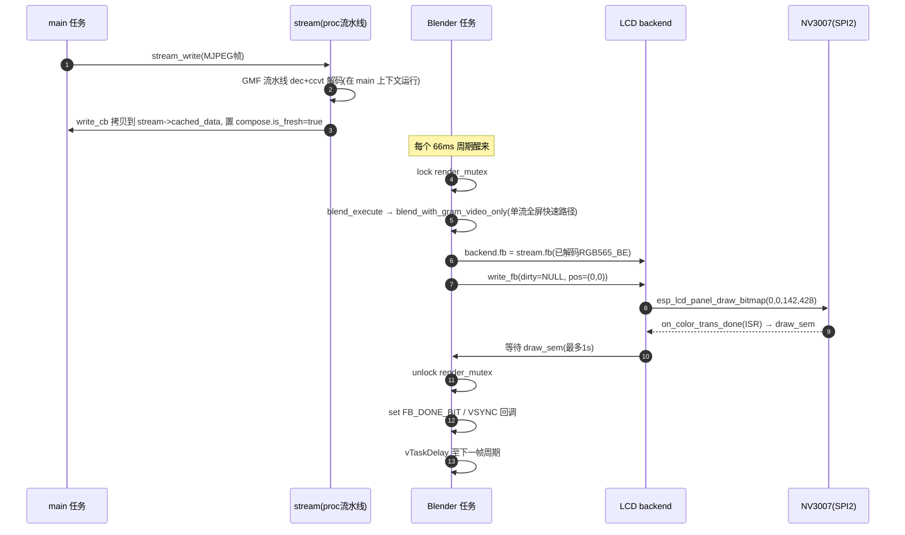
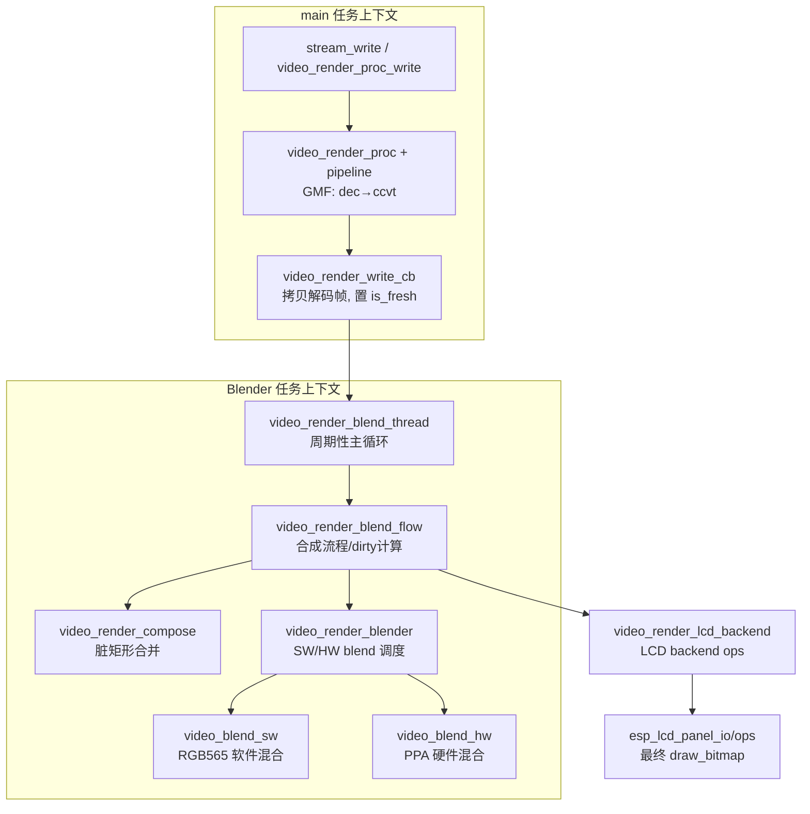
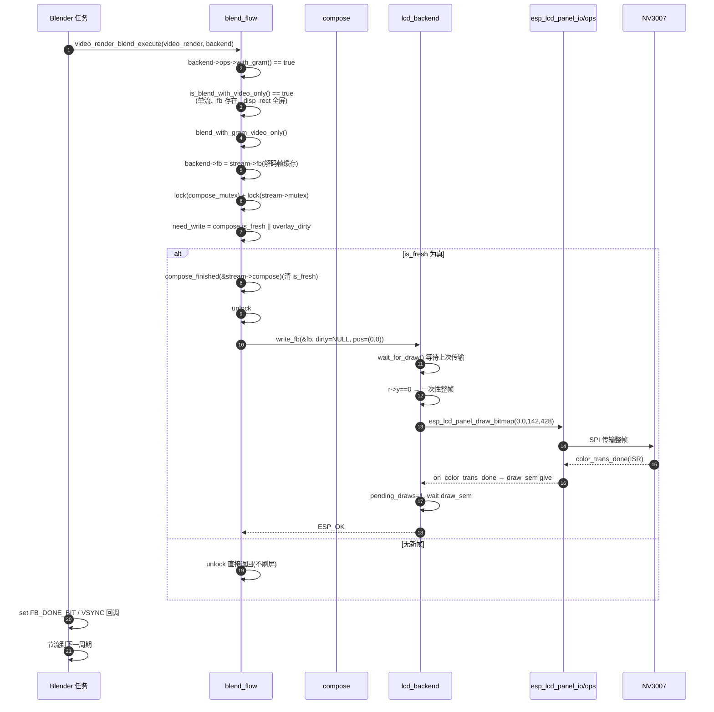
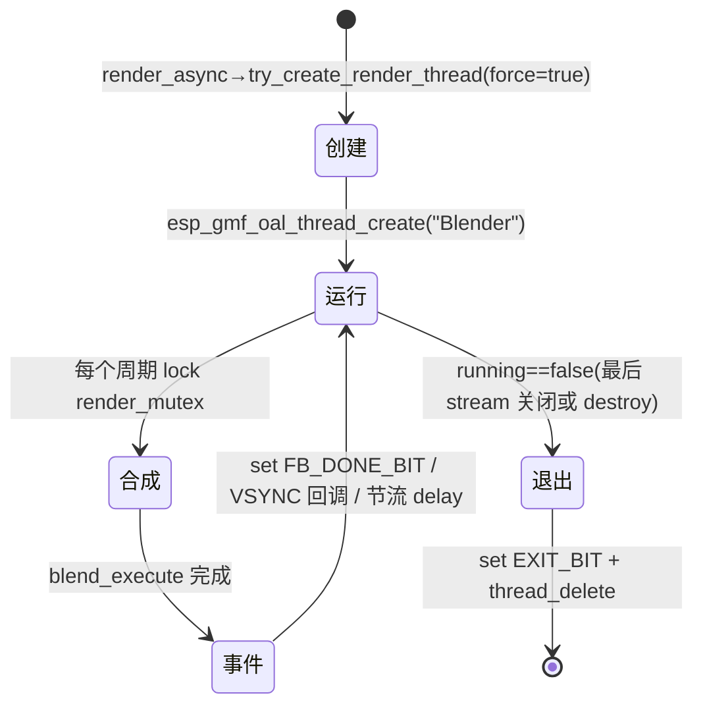
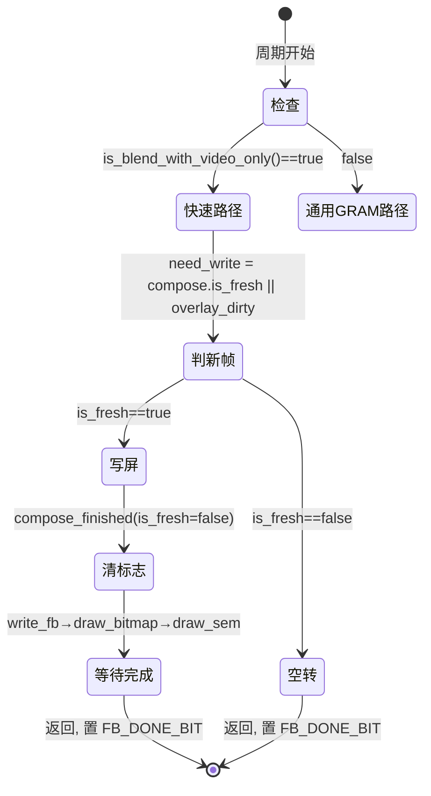
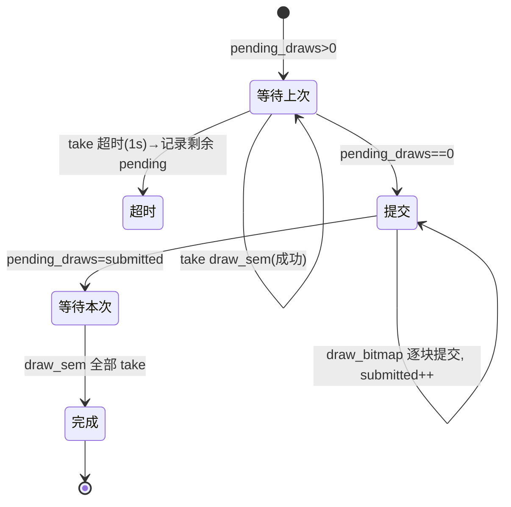

# 嵌入式系统程序分析：esp_video_render 的 `Blender` 任务

> 分析对象：`managed_components/espressif__esp_video_render` 组件内部的 `Blender` 渲染任务。
> 它在当前项目（NV3007 LCD MJPEG 播放器）中被 `esp_video_render_stream_render_async()` 触发创建，是除 main 任务外唯一实际参与运行的 FreeRTOS 任务。
> 所有结论以组件源码为依据；**事实**/**(推断)**/无法确认均单独标注。

作者：deepseek v4 pro

---

## 1. 程序是怎么运行的（Blender 任务视角）

### 1.1 运行模型总述

- `Blender` 任务运行于 **FreeRTOS**，由 `esp_video_render` 组件内部通过 `esp_gmf_oal_thread_create(NULL, "Blender", video_render_blend_thread, ...)` 创建（事实，`src/esp_video_render.c:418-435`）。
- 它是**周期性的合成/刷屏任务**，不负责解码。每个周期做一次"把各 stream 的帧合成到显示帧缓冲，并推给 LCD backend"，然后按配置帧率（本项目 15 fps）节流休眠。
- 任务的创建条件（事实）：
  - `esp_video_render_stream_open()` 调用 `try_create_render_thread(video_render, false)`；单 stream 时 `force=false` 且 `active_stream_num==1`，**不会**立即创建线程。
  - 本项目随后调用 `esp_video_render_stream_render_async()`，其内部 `try_create_render_thread(video_render, true)`，`force=true`，于是创建 `Blender` 线程（事实，`src/esp_video_render.c:509-515`、`418-437`）。
- 任务退出条件：主循环 `while (video_render->running)`；当最后一个 stream 关闭或 `esp_video_render_destroy()` 被调用时 `running` 被置 `false`，线程置 `VIDEO_RENDER_EXIT_BIT` 事件位后调用 `esp_gmf_oal_thread_delete(NULL)` 自删（事实，`src/video_render_blend_flow.c:893-937`、`src/esp_video_render.c:1037-1082`）。

### 1.2 任务属性

| 属性 | 值 | 来源 |
| :--- | :--- | :--- |
| 任务名 | `Blender` | `esp_video_render.c:433`（`esp_gmf_oal_thread_create` 第 1 参数） |
| 入口函数 | `video_render_blend_thread` | `video_render_blend_flow.c:893` |
| 栈大小 | 默认 20480 字节 | `Kconfig` `ESP_VIDEO_RENDER_BLEND_THREAD_STACK_SIZE` |
| 优先级 | 默认 8 | `Kconfig` `ESP_VIDEO_RENDER_BLEND_THREAD_PRIORITY` |
| 核 | 默认 core 0 | `Kconfig` `ESP_VIDEO_RENDER_BLEND_THREAD_CORE_ID` |
| 帧周期 | `1000 / fps`（本项目 15 fps → 约 66 ms） | `video_render_blend_flow.c:896-898`，fps 来自 `render_cfg.fps` |

> 本项目未调用 `esp_video_render_task_reconfigure()`，因此使用 Kconfig 默认栈/优先级/核（事实推断：`main/video_render_sys.c` 无该调用）。

### 1.3 主循环结构（事实，`video_render_blend_flow.c:893-937`）

```text
while (video_render->running) {
    1. lock(render_mutex)
    2. video_render_blend_execute(video_render, &backend)   // 合成 + 写屏
    3. unlock(render_mutex)
    4. event_grp.set(FB_DONE_BIT)                           // 通知"本帧已刷完"
    5. 若注册了 event_cb，回调 VSYNC 事件
    6. render_count++；按 start_time + period*render_count 计算期望时刻
    7. 若当前时刻 < 期望时刻 → vTaskDelay(差值)               // 节流到目标帧率
       否则若落后超过一个周期 → 打"Render too slow"日志并 vTaskDelay(1) 让出 CPU
}
event_grp.set(EXIT_BIT)；自删线程
```

- 这是**固定节拍的非阻塞循环**：所有阻塞点集中在 `video_render_blend_execute`（等互斥锁、等 LCD draw 完成）和末尾的 `vTaskDelay`，没有散落各处的休眠。

### 1.4 Blender 任务与其它参与者的交互



### 1.5 同步与通信机制（Blender 参与的部分）

| 机制 | 类型 | 位置 | 解决的问题 |
| :--- | :--- | :--- | :--- |
| `video_render->render_mutex` | 递归互斥锁 | `video_render_blend_flow.c:900` | 串行化 Blender 的合成周期与 stream 增删/关闭等结构变更，避免并发改 `stream_list` |
| `video_render->compose_mutex` | 递归互斥锁 | `blend_without_gram`/`blend_with_gram` | 保护 compose 可见性/alpha 等合成属性，避免 main 侧 `set_visible/set_alpha` 与合成并发 |
| `stream->mutex` | 递归互斥锁 | `blend_video_stream` 前 | 保护 `stream->fb`/`cached_data`，避免 main 侧写帧与 Blender 读帧冲突 |
| `backend->fb_lock[]` | 互斥锁（后端帧缓冲锁） | `lcd_backend_lock_fb` | 保护 LCD 帧缓冲（本项目视频快速路径不走 `get_fb`，较少用到） |
| `lcd->draw_sem` | 计数信号量 | `lcd_backend_write_fb` / `on_color_trans_done` | 等待上一次 SPI 刷屏完成；`pending_draws` 记未完成次数，防止覆盖正在传输的帧 |
| `video_render->event_grp` | 事件组 | `FB_DONE_BIT` / `EXIT_BIT` | 通知"一帧已刷完"（关闭清理用）和"Blender 已退出"（销毁等待用） |
| `stream->compose.is_fresh` | 标志位（非 OS 原语，由 mutex 保护） | `write_cb` / `blend_video_stream` | main 写完帧后置位，Blender 据此判断"有新帧需要合成" |
| `video_render_stream_rate_control` | 软件节流（在 main 侧 write 调用） | `esp_video_render.c:887-912` | 约束 main 写入速率，配合 Blender 的周期输出 |

---

## 2. 程序是怎么被设计和组织的（以 Blender 任务为中心）

### 2.1 模块关系图



### 2.2 各模块说明

#### 模块：`esp_video_render` 核心（`src/esp_video_render.c`）

- **功能**：render/stream 生命周期管理、render 句柄与 backend 管理、任务创建触发、帧写入入口。
- **是否包含任务**：不直接实现任务体，但通过 `try_create_render_thread()` 创建 `Blender` 线程。
- **关键 API**：
  - `esp_video_render_create/destroy`、`esp_video_render_set_display`
  - `esp_video_render_stream_open/close`、`esp_video_render_stream_render_async`
  - `esp_video_render_stream_write`（main 上下文写帧入口）
  - `video_render_build_proc`、`video_render_write_cb`（内部）
- **依赖**：`video_render_blend_flow`、`video_render_proc`、`video_render_sys`、`esp_video_render_blender`。
- **依赖原因**：写帧 → 流水线 → `write_cb` 置 `is_fresh` → Blender 合成，整条链路在此串联。

#### 模块：`video_render_blend_flow`（`src/video_render_blend_flow.c`）

- **功能**：Blender 任务主体与合成流程核心。决定"全量/局部刷新"、计算脏矩形、填充背景、混合 overlay 与 video stream、调 backend 写屏、做帧率节流。
- **是否包含任务**：是（`video_render_blend_thread`）。
- **关键 API**：
  - `video_render_blend_thread()` — 任务入口。
  - `video_render_blend_execute()` — 单次合成执行。
  - `blend_without_gram()` / `blend_with_gram()` / `blend_with_gram_video_only()` — 按 backend 是否带 GRAM 与是否单流全屏分派。
  - `blend_video_stream()` / `blend_overlay_region()` — 具体混合。
  - `fill_background()`、`get_initial_dirty_info()`、`video_render_calc_new_dirty()`。
- **依赖**：`video_render_compose`（脏矩形）、`esp_video_render_blender`（混合）、backend ops（写屏）。
- **依赖原因**：合成必须同时处理"哪些区域变了"与"像素怎么混合、怎么输出"。

#### 模块：`video_render_compose`（`src/video_render_compose.c`）

- **功能**：脏矩形（dirty region）的求交、求并、合并、opaque 传播，支撑局部刷新。
- **是否包含任务**：否。
- **关键 API**：`merge_dirty_rect()`、`video_compose_calc_dirty_area()`、`rect_union()`、`rect_intersect()`。
- **依赖**：`video_render_compose.h` 中定义的 `video_render_compose_t`。

#### 模块：`video_render_blender`（`src/video_render_blender.c`）

- **功能**：像素级混合的分发器，优先硬件（PPA），失败回退软件。
- **是否包含任务**：否。
- **关键 API**：
  - `esp_video_render_blend_open/close`
  - `esp_video_render_blend_process`（alpha 混合）
  - `esp_video_render_blend_transparent_color`
  - `esp_video_render_blend_fill` / `esp_video_render_blend_bitblt`
- **依赖**：`video_blend_hw`、`video_blend_sw`。

#### 模块：`video_blend_hw`（`src/video_blend_hw.c`）

- **功能**：基于 **PPA**（Pixel Processing Accelerator）的硬件混合/填充/位块拷贝。
- **是否包含任务**：否。
- **关键 API**：`video_render_blend_hw_open/close/process/fill/bitblt`、`video_render_blend_hw_can_accel/can_fill`。
- **依赖**：`driver/ppa.h`（仅当 `CONFIG_SOC_PPA_SUPPORTED`）。
- **依赖原因**：ESP32-S3 具备 PPA 时用硬件加速；本项目 `create_default_pool` 对 S3 用软件 scale/crop（事实，`main/video_render_sys.c:50-64`），但 blend 仍可能走 PPA（见 §5 推断）。

#### 模块：`video_blend_sw`（`src/video_blend_sw.c`）

- **功能**：RGB565（LE/BE）软件 alpha 混合、透明色混合、填充。
- **是否包含任务**：否。
- **关键 API**：`esp_video_render_blend_sw`、`..._transparent_color_sw`、`..._fill_sw`。
- **依赖**：`video_render_utils.h`（取像素位数等）。

#### 模块：`video_render_proc` + `video_render_pipeline`（`src/video_render_proc.c`、`src/video_render_pipeline.c`）

- **功能**：把 `dec/ccvt/scale/crop/rotate` 等 GMF 元素组织成流水线并执行。**注意**：其执行发生在调用 `stream_write` 的 **main 任务上下文**，不在 Blender 任务内（事实，`private_inc/video_render_proc.h` 注释 "Currently all processor runs in input context"）。
- **是否包含任务**：否。
- **关键 API**：`video_render_proc_open/write/close`、`video_render_pipeline_open/close`。
- **依赖**：GMF 元素池、`esp_gmf_pipeline`。
- **依赖原因**：Blender 只负责"合成已解码的 `stream->fb`"，解码/格式转换由此模块在写帧时同步完成。

#### 模块：`video_render_lcd_backend`（`src/impl/video_render_lcd_backend.c`）

- **功能**：LCD 显示后端。为 `DVP`(SPI/GRAM) / `RGB` / `DPI` 提供 `get_fb/lock_fb/write_fb` 等 ops；DVP 路径按行分块 `esp_lcd_panel_draw_bitmap` 并通过计数信号量等待传输完成。
- **是否包含任务**：否。
- **关键 API**：`esp_video_render_get_lcd_backend()`、`lcd_backend_write_fb()`、`lcd_backend_wait_for_draw()`、`on_color_trans_done()`。
- **依赖**：`esp_lcd_panel_io/ops`、`video_render_sys`。
- **依赖原因**：Blender 最终把合成结果通过此 backend 写屏。

#### 模块：`esp_video_render_worker`（`src/esp_video_render_worker.c`）

- **功能**：可选的独立 `Worker` 任务（带数据队列，用于异步处理帧）。
- **是否包含任务**：是（任务名 `Worker`）。
- **本项目是否使用**：否（事实：本项目代码未调用 `esp_video_render_worker_*`）。
- **说明**：它属于组件提供的另一类任务，与 `Blender` 不同，分析中列出以避免混淆。

---

## 3. 程序运行时核心数据结构（Blender 相关）

#### video_render_t

render 系统顶层上下文，Blender 线程的 `arg`。定义于：`private_inc/video_render_internal.h#102`。

| 类型 | 名称 | 说明 |
| :--- | :--- | :--- |
| `esp_video_render_cfg_t` | `cfg` | 含 `pool` 与 `fps`（Blender 节拍来自此 fps） |
| `esp_video_render_compose_mode_t` | `compose_mode` | AUTO/MANUAL；影响是否创建线程、是否直接渲染 |
| `esp_video_render_task_cfg_t` | `task_cfg` | Blender 任务栈/优先级/核（可重配） |
| [video_render_backend_t](#video_render_backend_t) | `backend` | 显示后端 |
| [video_render_stream_t](#video_render_stream_t) | `stream_list` | 活动 stream 链表（Blender 逐个合成） |
| `bool` | `running` | Blender 主循环条件；置 false 触发退出 |
| `esp_video_render_blend_handle_t` | `blender` | 混合器句柄 |
| `video_render_mutex_handle_t` | `render_mutex` | 合成周期/结构变更互斥锁 |
| `video_render_mutex_handle_t` | `compose_mutex` | 合成属性互斥锁 |
| `video_render_event_grp_handle_t` | `event_grp` | FB_DONE / EXIT 事件 |
| `uint8_t` | `active_stream_num` | 活动 stream 数（决定是否创建线程/快速路径） |
| `esp_video_render_format_t` | `display_format` | 显示格式（本项目 RGB565_BE） |
| `uint16_t` | `display_width` / `display_height` | 显示分辨率（142×428） |

#### video_render_stream_t

单个视频流；Blender 的合成输入源。定义于：`private_inc/video_render_internal.h#77`。

| 类型 | 名称 | 说明 |
| :--- | :--- | :--- |
| [video_render_compose_t](#video_render_compose_t) | `compose` | 可见性/新鲜度/脏矩形/alpha/zorder |
| `esp_video_render_frame_info_t` | `frame_info` | 输入帧格式/宽高/fps |
| `esp_video_render_rect_t` | `src_rect` | 源裁剪区 |
| `bool` | `cached` | 是否缓存解码帧（本项目 true） |
| `uint8_t *` | `cached_data` | 缓存帧数据（解码后） |
| `uint32_t` | `cached_size` | 缓存大小 |
| `esp_video_render_fb_t` | `fb` | 供 Blender 读取的帧缓冲 |
| `bool` | `using_fb` | 是否外部帧缓冲（write_fb 路径） |
| `bool` | `running` | stream 是否运行 |
| `bool` | `need_rebuild` | 需要重建 proc 流水线 |
| `video_render_mutex_handle_t` | `mutex` | 保护 fb/cached 数据 |
| `video_render_proc_handle_t` | `proc_hd` | GMF 处理流水线句柄 |
| `int16_t` | `degree` | 旋转角 |
| `uint32_t` | `write_start` / `write_count` | 写帧节流用 |

#### video_render_backend_t

显示后端上下文。定义于：`private_inc/video_render_internal.h#62`。

| 类型 | 名称 | 说明 |
| :--- | :--- | :--- |
| `esp_video_render_backend_ops_t *` | `ops` | 后端操作集（init/get_fb/lock_fb/write_fb/...） |
| `esp_video_render_backend_handle_t` | `handle` | 后端实例（LCD backend 为 `lcd_backend_t`） |
| `esp_video_render_fb_t` | `fb` | 当前显示帧缓冲 |
| `esp_video_render_fb_t` | `bg_fb` | 背景帧缓冲 |
| `esp_video_render_clr_t` | `bg_color` | 背景色 |
| `bool` | `is_bg_set` / `is_bg_decoded` | 背景是否已设置/已解码 |
| [video_render_fb_info_t](#video_render_fb_info_t) | `fb_info` / `prev_fb` / `cur_fb` | 帧缓冲脏区跟踪链表 |

#### video_render_fb_info_t

每个帧缓冲的脏区与背景填充状态。定义于：`private_inc/video_render_internal.h#49`。

| 类型 | 名称 | 说明 |
| :--- | :--- | :--- |
| `esp_video_render_dirty_rect_t[16]` | `dirty_region` | 脏矩形数组（最多 16） |
| `uint8_t` | `dirty_count` | 脏矩形个数 |
| `bool` | `is_bg_filled` | 背景是否已填充 |
| `bool` | `redraw_all` | 是否整屏重绘 |
| `uint8_t *` | `fb_buffer` | 关联的帧缓冲指针 |
| `video_render_fb_info_t *` | `next` | 链表 |

#### video_render_compose_t

合成状态（stream 与 overlay 区域共用）。定义于：`include/vui/esp_vui_overlay.h#52-66`。

| 类型 | 名称 | 说明 |
| :--- | :--- | :--- |
| `uint8_t`(位域) | `visible` / `is_visible` | 当前/上一次可见状态 |
| `uint8_t`(位域) | `is_fresh` | 有新帧需要重绘（Blender 的主要触发条件） |
| `uint8_t`(位域) | `is_empty` | 无数据 |
| `uint8_t`(位域) | `opaque` | 是否完全不透明 |
| `uint8_t`(位域) | `is_trans_color` | 是否使用透明色 |
| `esp_video_render_clr_t` | `trans_color` | 透明色 |
| `uint8_t` | `alpha` | 全局透明度 |
| `uint8_t` | `zorder` | 层叠顺序 |
| `esp_video_render_rect_t` | `prev_rect` | 上一帧位置（用于移动后清旧区域） |
| `esp_video_render_rect_t` | `disp_rect` | 显示区域 |
| `uint8_t` | `dirty_count` | 脏区个数 |
| `esp_video_render_dirty_rect_t[2]` | `dirty_area` | 脏区 |

#### lcd_backend_t

LCD 后端实例。定义于：`src/impl/video_render_lcd_backend.c#25-48`。

| 类型 | 名称 | 说明 |
| :--- | :--- | :--- |
| `esp_video_render_lcd_cfg_t` | `cfg` | LCD 类型/分辨率/格式/句柄 |
| `bool` | `with_gram` | 是否 GRAM 屏（DVP=SPI 时为 true） |
| `uint8_t *[2]` | `fb` | 帧缓冲（手动分配或面板提供） |
| `video_render_mutex_handle_t[2]` | `fb_lock` | 每个 fb 的锁 |
| `uint32_t` | `fb_size` | 单帧缓冲字节数 |
| `bool` | `manual_fb` | 是否手动分配 fb |
| `uint8_t` | `fb_num` / `disp_fb` | 帧缓冲个数 / 当前显示缓冲索引 |
| `video_render_mutex_handle_t` | `mutex` | 保护 disp_fb 切换 |
| `uint16_t` | `pending_draws` | 尚未完成的刷屏次数 |
| `bool` | `wait_for_draw` | 是否需要等待传输完成 |
| `SemaphoreHandle_t` | `draw_sem` | 计数信号量，传输完成时 give |

#### video_proc_t

GMF 处理流水线上下文（运行在写帧方，即 main 任务）。定义于：`src/video_render_proc.c#27-41`。

| 类型 | 名称 | 说明 |
| :--- | :--- | :--- |
| `esp_gmf_pool_handle_t` | `pool` | 元素池 |
| `esp_gmf_element_handle_t *` | `proc_elements` | 预创建元素 |
| `esp_gmf_pipeline_handle_t` | `pipeline` | 实际流水线 |
| `bool` | `is_opened` / `is_error` / `is_writing` | 状态 |
| `esp_video_render_write_cb_t` | `writer` | 输出回调（即 `video_render_write_cb`） |
| `uint8_t *` | `frame_buffer` / `out_frame_buf[]` | 输入/输出缓冲 |
| `esp_video_render_frame_t` | `out_frame` | 输出帧描述 |

#### esp_video_render_task_cfg_t

任务配置。定义于：`include/esp_video_render_types.h#144-148`。

| 类型 | 名称 | 说明 |
| :--- | :--- | :--- |
| `uint32_t` | `stack_size` | 栈大小 |
| `uint8_t` | `priority` | 优先级 |
| `uint8_t` | `core_id` | 绑定核 |

---

## 4. 关键业务如何被执行（Blender 的一个合成周期）

### 4.1 业务：把"已解码的新帧"合成为 LCD 上的一帧

- **触发（输入）**：main 任务 `stream_write()` 后，`video_render_write_cb()` 将解码帧拷入 `stream->cached_data` 并置 `stream->compose.is_fresh = true`（事实，`esp_video_render.c:806-850`）。Blender 按 15 fps 周期醒来检查该标志。
- **处理**：`video_render_blend_thread` → `video_render_blend_execute` →（本项目）`blend_with_gram_video_only` → `lcd_backend_write_fb` → `esp_lcd_panel_draw_bitmap`。
- **输出（结果）**：NV3007 屏刷新一帧，`on_color_trans_done` 中断回调给 `draw_sem`，Blender 等待完成后置 `FB_DONE_BIT`，再节流到下一周期。

### 4.2 本项目实际走的"单流全屏视频快速路径"调用链



### 4.3 通用路径（多流/局部刷新）要点（事实）

当不是"单流全屏"时，`video_render_blend_execute` 按 backend 是否 GRAM 分派：

- `blend_without_gram()`：`get_fb` → 计算初始脏区 → 无新内容则返回 → 计算新脏区并合并 → `fill_background` → 对每个 stream：`blend_overlay_region` 后 `blend_video_stream` → `write_fb`。
- `blend_with_gram()`：类似，但 GRAM 屏可局部刷新；脏矩形合并成一个矩形（保持整行宽）后作为 `write_rect` 传给 `write_fb`，`pos=NULL`。
- `blend_video_stream()`（`video_render_blend_flow.c:447-509`）：`redraw_all` 时整块 blend，否则只对与脏区相交的矩形逐块 blend；调用 `esp_video_render_blend_process`（alpha 混合）。
- `fill_background()`：背景未填时整屏填充；否则仅对不透明脏区补背景。

### 4.4 关键数据状态变化（一个周期）

| 时刻 | 变量 | 变化 |
| :--- | :--- | :--- |
| main 写帧后 | `stream->compose.is_fresh` | `false → true`（`write_cb`） |
| 周期开始 | `backend->fb` | 快速路径下指向 `stream->fb`（已解码帧） |
| 合成前 | `stream->mutex` / `compose_mutex` | 加锁，防止 main 同时改 fb |
| 合成中 | `stream->compose.is_fresh` | `true → false`（`compose_finished`） |
| 写屏前 | `lcd->pending_draws` | 等待上次完成后置 0，随后按本次提交置 1（或行数） |
| 写屏中 | `lcd->disp_fb` | 多 fb 时 `(disp_fb+1)%fb_num` 切换 |
| 传输完成 | `lcd->draw_sem` | ISR `give`，Blender `take` 解除阻塞 |
| 周期结束 | `event_grp` | 置 `FB_DONE_BIT` |
| 节流 | Blender | `vTaskDelay` 至 `start_time + period*render_count` |

---

## 5. 提炼关键运行状态

### 5.1 跨周期持续存在、影响后续行为的状态变量

| 变量 | 所属 | 状态语义 | 影响场景 |
| :--- | :--- | :--- | :--- |
| `video_render->running` | render | Blender 生命周期开关 | 为 false 时线程退出并置 `EXIT_BIT` |
| `stream->compose.is_fresh` | stream | 是否有新帧待合成 | Blender 决定本周期刷屏还是空转 |
| `stream->compose.dirty_count/dirty_area` | stream | 合成层自身的脏区 | 参与最终脏矩形合并 |
| `backend->cur_fb->redraw_all` / `dirty_count` | backend fb_info | 整屏重绘/局部重绘 | 决定全量 blend 还是逐矩形 blend、write_fb 传不传 dirty_rect |
| `backend->cur_fb->is_bg_filled` | backend fb_info | 背景是否已填充 | 决定 `fill_background` 是否执行 |
| `lcd->pending_draws` | lcd backend | 未完成刷屏次数 | `wait_for_draw` 等待次数；为 0 直接通过 |
| `lcd->disp_fb` | lcd backend | 当前显示缓冲索引 | 多 fb 时决定下次写入缓冲 |
| `lcd->draw_sem` | lcd backend | 刷屏完成信号 | Blender 阻塞等待 SPI 传输完成 |
| `stream->write_start/write_count` | stream | main 写帧节流基准 | 决定 main 侧是否 `vTaskDelay` 节流 |
| `stream->need_rebuild` | stream | 流水线需重建 | 下次 `stream_write` 触发 `video_render_build_proc` |
| `stream->cached_data/cached_size` | stream | 解码帧缓存 | Blender 直接读取该缓冲作为输出源 |

### 5.2 状态图

#### Blender 任务生命周期（事实，`video_render_blend_flow.c:893-937` + `esp_video_render.c`）



#### 单周期"是否需要刷屏"判定（快速路径，事实：`blend_with_gram_video_only`）



#### LCD backend 刷屏等待状态（事实：`lcd_backend_write_fb`/`wait_for_draw`）



---

## 6. 本项目实际配置下的关键结论（含推断）

1. **解码不在 Blender 里**（事实）：`video_render_proc_write()` 在 `esp_video_render_stream_write()` 调用上下文（main 任务）同步执行 GMF 流水线；`private_inc/video_render_proc.h` 明确注释 "Currently all processor runs in input context"。因此 main 任务负责"读 MJPEG → 解码 → 颜色转换"，Blender 只负责"把解好的帧刷到屏上"。
2. **单流全屏走零拷贝快速路径**（事实 + 推断）：本项目 stream 显示区 142×428 等于显示分辨率、只有 1 个 stream、`cached=true` 使 `stream->fb.data` 有效，故 `is_blend_with_video_only()` 为真，Blender 直接把 `backend->fb = stream->fb` 后调 `write_fb`，**不分配后端手动帧缓冲、不做 alpha 混合**。
3. **Blender 的周期是软节拍，不是硬件 VSYNC**（事实）：组件通过 `esp_timer_get_time()` 计算 `start_time + period*render_count` 并 `vTaskDelay` 实现近似 15 fps；`VSYNC` 只是组件内事件命名，并非来自 LCD TE 信号。
4. **LCD 传输完成依赖 `esp_lcd_panel_io` 的 color_trans_done 回调**（事实）：`lcd_backend_init` 在 DVP 路径注册 `on_color_trans_done`，ISR 里 `give(draw_sem)`；这解释了本项目 `hardware_init.c` 中注释掉的 `s_trans_done` 信号量为何不再需要——backend 会自己注册回调。
5. **PPA 硬件混合是否实际生效取决于芯片与 `CONFIG_SOC_PPA_SUPPORTED`**（推断）：ESP32-S3 若支持 PPA，`esp_video_render_blend_process` 会先试 `video_render_blend_hw_process`，失败回退软件混合；本项目快速路径不调用 blend，故 PPA 通常不参与（推断）。
6. **`Blender` 与官方示例的 `Worker` 是两个不同任务**（事实）：`Worker` 由 `esp_video_render_worker_create` 创建，本项目未使用；不要将二者混淆。

---

## 7. 无法确认 / 存疑点

1. **`esp_gmf_oal_thread_create` 的实际映射**：它封装了 `xTaskCreate*` 还是带内存能力属性的 `xTaskCreatePinnedToCoreWithCaps`，需查 GMF OAL 源码确认；本文只确认到"创建名为 Blender 的线程"这一层。
2. **优先级 8 与 main 任务优先级的相对关系**：main 任务优先级来自 FreeRTOS 启动配置，未在本项目/组件中直接看到，因此"Blender 是否抢占 main"无法仅凭组件源码确定。
3. **`draw_sem` 单帧实际 give 次数**：DVP 路径 `pending_draws=submitted`，一次整帧提交时 submitted=1；但若 LCD 面板驱动对一次 `draw_bitmap` 回调多次 `color_trans_done`，计数语义可能不同，本文按组件实现描述。
4. **快速路径下 `backend->fb_info` 的脏区跟踪**：`blend_with_gram_video_only` 会调用 `video_render_check_fb_info` 建立跟踪，但该路径不再做脏矩形计算，其 `redraw_all/dirty` 基本不使用，具体影响以运行日志为准。
